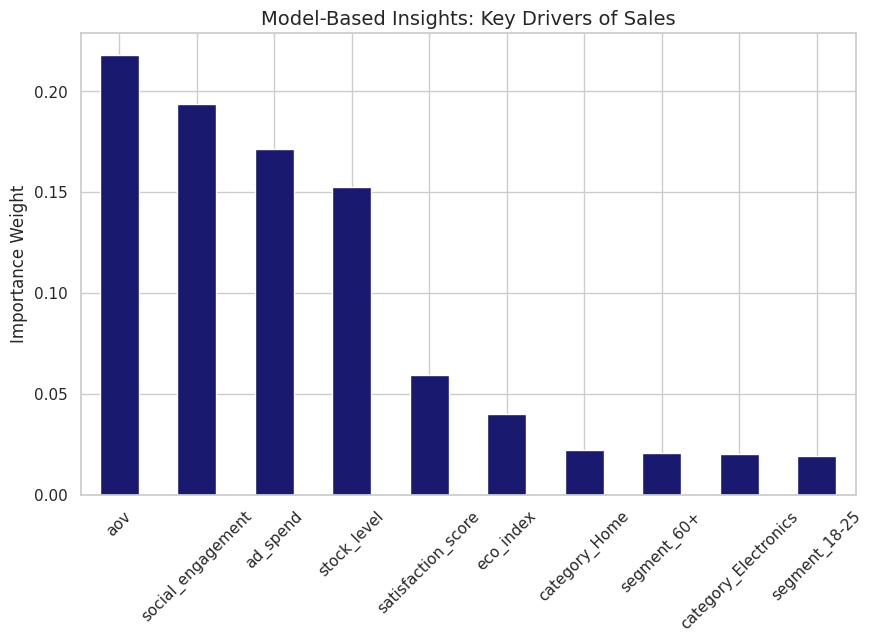
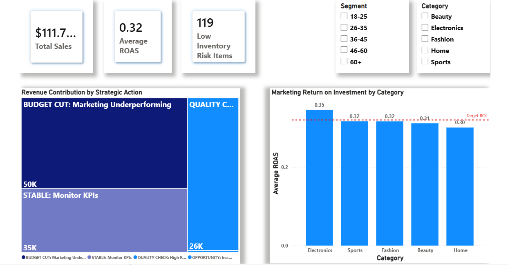
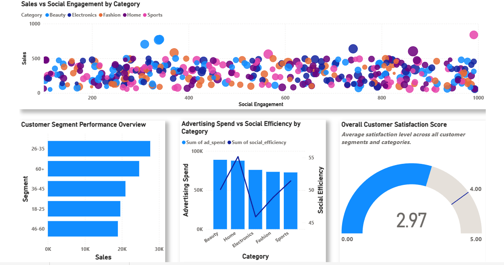
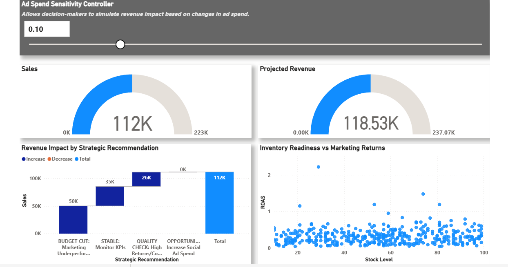

# Omni-Channel Retail Momentum: Marketing Intelligence & Prescriptive Analytics

## 📌 Project Overview
This project delivers an end-to-end **Retail & Marketing Analytics solution** designed to transform raw e-commerce data into **actionable business intelligence**.  
The analysis combines **SQL-based analytics engineering**, **Python-driven advanced analytics**, and **interactive BI dashboards** to support marketing optimization, customer insights, inventory alignment, and revenue growth decisions.

Rather than focusing solely on prediction accuracy, the project emphasizes **business interpretability, efficiency diagnostics, scenario analysis, and prescriptive decision support**, reflecting real-world analytics use cases.

---

## 🎯 Business Objectives
- Evaluate marketing effectiveness across product categories and customer segments
- Identify key drivers of sales and marketing efficiency
- Detect underperforming campaigns and high-growth opportunities
- Align marketing spend with inventory readiness
- Enable scenario-based decision-making using what-if analysis

---

## 🧱 Data & Analytics Architecture

| Layer | Tool | Purpose |
|----|----|----|
| Data Modeling | SQL (MySQL) | Staging, KPI engineering, strategic logic |
| Advanced Analytics | Python | EDA, modeling, feature importance, simulations |
| Visualization | Power BI | Executive dashboards & decision support |

---

## 🗄️ SQL: Analytics Engineering & KPI Modeling

### 1. Staging Layer
Created a clean staging view to standardize raw retail data and prepare it for analytics.

**Key actions:**
- Renamed raw columns into analytics-friendly fields
- Selected relevant business features only
- Isolated raw data from analytical logic

### 2. KPI Engineering Layer
Built a KPI view to derive core performance metrics:
- **ROAS (Return on Ad Spend)**
- **Social Engagement Efficiency**
- **Inventory Health Status (Critical / Low / Healthy)**

Defensive SQL techniques such as `NULLIF()` were used to prevent divide-by-zero errors.

### 3. Prescriptive Strategy Fact Table
Developed a fact table that converts KPIs into **strategic business recommendations**, including:
- Budget cuts for underperforming campaigns
- Quality checks for high-return but low-satisfaction areas
- Scaling opportunities for high-ROAS, high-engagement segments
- Urgent restocking for high-ROI but low-inventory categories

This table directly powers dashboards and scenario analysis.

---

## 🧠 Python: Advanced Analytics & Decision Intelligence

### Exploratory Data Analysis (EDA)
- Correlation analysis (marketing attribution matrix)
- Sales vs social engagement relationships
- Category-level ROAS comparison
- Customer segment performance analysis
- Inventory vs marketing return diagnostics

### Feature Engineering & Modeling
- Prepared ML-ready datasets from SQL outputs
- Applied one-hot encoding for categorical features
- Built a **Random Forest regression model** to identify key drivers of sales
- Evaluated model performance using **R² and MAE**

> The model is used for **directional insight and driver analysis**, not precise forecasting, due to high variance and noise common in marketing data.

### Explainable Model Insights
- Extracted and visualized feature importance
- Identified major contributors such as:
  - Average Order Value
  - Ad Spend
  - Social Engagement
  - Inventory Availability
  - Customer Satisfaction



---

## 🔁 Scenario Analysis & What-If Simulation

A what-if simulation engine was built to evaluate marketing decisions under different scenarios.

**Example scenario:**
- Increasing ad spend by 20%
- Resulted in a **~12% model-implied revenue uplift**, assuming other factors remain constant

This supports **budget sensitivity analysis and decision comparison**, rather than point forecasting.

---

## 📊 Power BI Dashboard Design

The final solution is delivered through a **multi-page executive dashboard**:

### Page 1: Executive Sales & Marketing Performance Overview
- Key KPIs (Sales, ROAS, Inventory Risk)
- Revenue contribution by strategic action
- Marketing Return on Investment by Category



---

### Page 2: Marketing & Customer Behavior Analysis
- Sales vs social engagement
- Customer segment performance
- Advertising spend vs social efficiency
- Overall customer satisfaction index



---

### Page 3: Prescriptive Analytics & What-If Simulation
- Ad spend sensitivity controller
- Current vs projected revenue
- Revenue impact by strategic recommendation
- Inventory readiness vs marketing returns



---

## 💡 Key Business Insights
- Marketing efficiency (ROAS) is a stronger driver of revenue than raw spend
- Certain product categories act as consistent profit engines
- High engagement does not guarantee higher sales or satisfaction
- Inventory readiness is critical before scaling marketing investments
- Scenario analysis enables informed budget trade-offs without relying on exact forecasts

---

## 🧾 Tools & Technologies
- **SQL (MySQL)** – Data modeling, KPI engineering, prescriptive logic
- **Python** – Pandas, NumPy, scikit-learn, Matplotlib, Seaborn
- **Power BI** – Interactive dashboards and scenario simulation
- **Jupyter Notebook** – Analytics development

---

## 🏁 Conclusion
This project demonstrates how retail and marketing data can be transformed into **decision-ready intelligence** by combining analytics engineering, advanced analysis, and prescriptive modeling.  
By focusing on **interpretability, business relevance, and scenario-driven insights**, the framework mirrors real-world analytics practices used to guide strategic and operational decisions.

---

## 🔧 Limitations
- Predictive modeling focuses on directional insights rather than exact forecasts due to data variance.
- Scenario analysis assumes other variables remain constant.
- Results should be interpreted as decision-support guidance rather than guaranteed outcomes.

---

## 📎 Future Enhancements
- Incorporate time-series modeling for seasonality
- Add attribution modeling across marketing channels
- Automate strategy rules using thresholds learned from data
- Deploy dashboards with live data connections

---

## 👤 Author
**Muhammed Nafih**  
Data Analyst | Marketing & Business Analytics | Python | SQL | Power BI

🔗 **LinkedIn:**  
https://www.linkedin.com/in/nafihhmohd/

---

## ▶️ How to Run
1. Clone the repository  
   ```bash
   git clone https://github.com/nafihhmohd/omnichannel-retail-momentum.git

